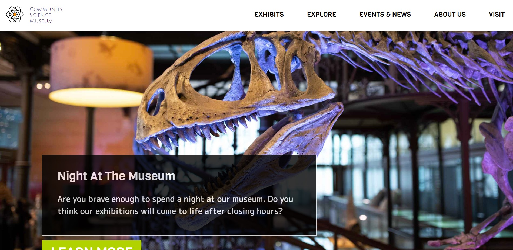

# Science Community Museum

  
[Visit deployed site here](https://community-museum-exam.netlify.app/ "Community museum")

[Visit figma prototype here](https://www.figma.com/file/0BlXc83GsCHrTFYlWSgqkK/Untitled?node-id=1%3A117&t=SKmdzD8JH0yX6dyN-1 "Community museum")

---

# Process and result

This was a fun project where I really enjoyed the design aspect of it. The raget audience was kids in the age of 8-17 years so I wanted to make the page colorful and intriguing for the youngest ones yet not too childish. The page should also be practical and nice enough for parents to navigate and use.

Looking back now there are definitively thing I would change about the design; making it a little less crowded, removing the black background and removing the white borders around text-boxes.

This page is build with only HTML and CSS and has no real functionality.

The CSS coding went pretty well until the latest stage of the process. There was minor alignment issues I wanted to fix by using "quick fixes" and also a whole new section I wanted to add right before delivery. Bad idea. Things got messy and nearly 1/3 of my CSS file was added last-minute due to the aforementioned "quick fixes" I came up with.

I learned my lesson though and wont be as reckless in future projects.

---

# Assignment

Create a website using only vanilla HTML and CSS.
The website is for a new local community museum for kids in the age range 8-17 year old.  
The page should have a attractive design and be easy to navigate. The site should include between 4-6 pages.

---

# Sources

All icons, including Social Media icons, is taken from FontAwesome
https://fontawesome.com/

All images used is taken either from the Zip.file that came with the project or from
https://unsplash.com/

Google Maps Screenshot – Only a placeholder

In order to use gradients:
https://www.w3schools.com/css/css3_gradients.asp

To learn more about layouts:
https://www.youtube.com/watch?v=Nloq6uzF8RQ
